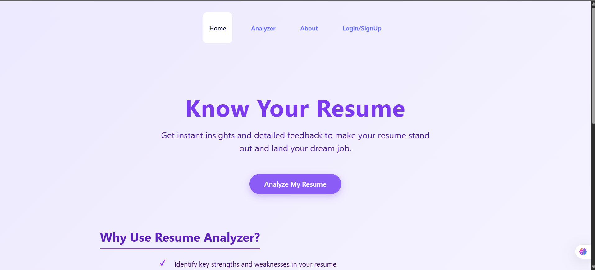
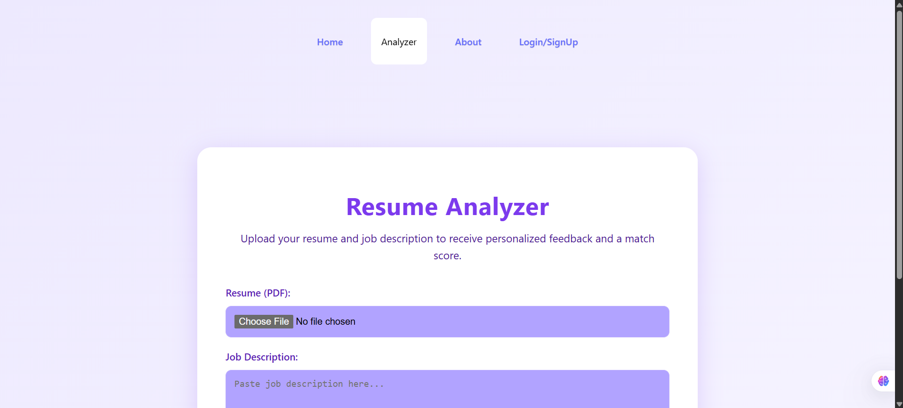
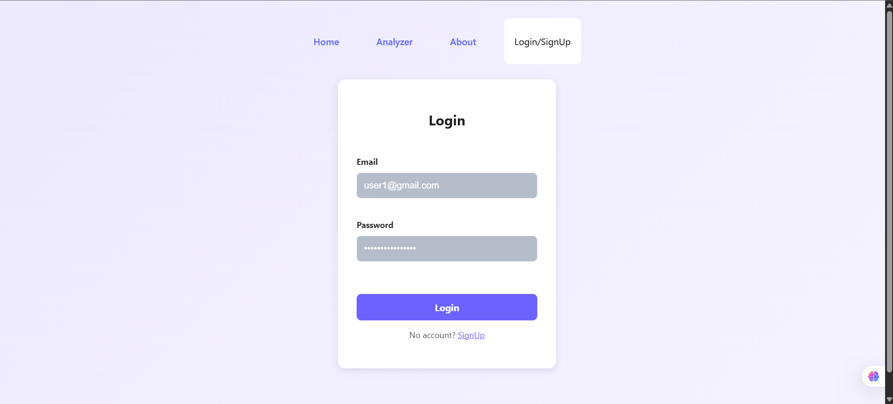

<p align="center">
</p>

# 🧠 Resume Analyzer App

A full-stack AI-powered web application that analyzes resumes and provides both general and detailed improvement suggestions. Built using React.js for the frontend, Flask for the backend, and integrated with state-of-the-art NLP models from HuggingFace.

---

## 🚀 Features

- 🔐 **User Authentication**: Secure login and registration with JWT tokens.
- 📄 **Resume Upload**: Parse and process uploaded PDF resumes.
- 📊 **Basic Suggestions**: Cosine similarity analysis using Sentence Transformers.
- 🤖 **Advanced NLP Feedback**: Powered by HuggingFace transformers for deeper improvement points.
- 🎨 **Beautiful UI**: Smooth transitions and animations with Framer Motion and GSAP.

---

## 🖼️ Screenshots

### 🏠 Homepage



---

### 📤 Resume Analyzer Page



---

### 📊 Authentication Login/Signup Page



---

### 📊 AboutPage Login/Signup Page


---

## 🛠️ Tech Stack

| Layer    | Technology                              |
| -------- | --------------------------------------- |
| Frontend | React.js, Vite, Framer Motion, GSAP     |
| Backend  | Flask, Flask-SQLAlchemy, JWT, bcrypt    |
| ML/NLP   | Sentence Transformers, Transformers Hub |
| Database | SQLite3                                 |
| OCR      | PyMuPDF, pytesseract                    |

---

## 📁 Folder Structure

```
resume-analyzer/
├── images/
│   ├── homepage.png
│   ├── upload_resume.png
│   └── feedback_section.png
├── backend/
│   ├── app.py
│   ├── analyzer_routes.py
│   ├── auth_utils.py
│   ├── requirements.txt
│   └── ...
├── frontend/
│   ├── package.json
│   ├── vite.config.js
│   ├── src/
│   │   ├── components/
│   │   ├── pages/
│   │   └── ...
│   └── public/
├── setup.bat         # Windows CMD setup script
├── setup.ps1         # Windows PowerShell setup script
├── setup.sh          # Linux/macOS setup script
└── README.md
```

---

## ⚙️ Environment Variables

Create a `.env` file in the `backend/` directory with the following:

```
FLASK_APP=app.py
FLASK_ENV=development
SECRET_KEY=your_flask_secret_key
JWT_SECRET_KEY=your_jwt_key
DATABASE_URI=sqlite:///resume.db
```

> ☑️ Make sure to keep secret keys hidden in production (e.g., using `.gitignore`).

---

## 🔧 Setup Script Details

This project includes auto-install scripts to simplify installation across all operating systems.

### 📁 Script Files

| File        | Platform             | Description                                  |
| ----------- | -------------------- | -------------------------------------------- |
| `setup.bat` | Windows (CMD)        | Double-click or run via `cmd.exe`            |
| `setup.ps1` | Windows (PowerShell) | Run in PowerShell with execution permissions |
| `setup.sh`  | Linux / macOS        | Bash script for Unix-based systems           |

---

### 🪟 Windows CMD (`setup.bat`)

```
cd project-folder
setup.bat
```

---

### 💻 Windows PowerShell (`setup.ps1`)

```
Set-ExecutionPolicy -ExecutionPolicy RemoteSigned -Scope Process
.\setup.ps1
```

---

### 🐧 Linux/macOS (`setup.sh`)

```
chmod +x setup.sh
./setup.sh
```

---

## 🧪 How to Run the Project

### 1. Start Backend

> # Windows

```
cd backend
venv\Scripts\activate
```

> # macOS/Linux

```
source venv/bin/activate
python app.py
```

Flask server will usually run at: `http://localhost:5000`

---

### 2. Start Frontend

```
cd frontend
npm run dev
```

React frontend will run at: `http://localhost:5173`

---

## 🌐 API Endpoints

| Endpoint          | Method | Description                          |
| ----------------- | ------ | ------------------------------------ |
| `/register`       | POST   | Register a new user                  |
| `/login`          | POST   | Login with credentials               |
| `/analyze/resume` | POST   | Upload resume and receive feedback   |
| `/about`          | GET    | just a page about who am i and stuff |

---

## 📦 Backend Requirements (Flask, ML, OCR)

Install all dependencies with:

```
pip install -r requirements.txt
```

Key packages:

- Flask, Flask-CORS, Flask-SQLAlchemy
- bcrypt, PyJWT
- transformers, sentence-transformers
- pytesseract, PyMuPDF

---

## 📦 Frontend Requirements (React.js)

Install all dependencies with:

```
cd frontend
npm install
```

Key packages:

- React 19+
- React Router
- Framer Motion
- GSAP
- Axios
- Vite

---
